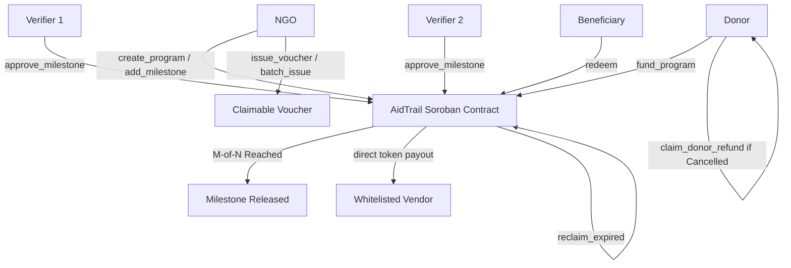

# Kindred AidTrail Smart Contracts (`aidtrail-contracts`)

[](https://github.com/Kindred-AidTrail/Aidtrail-contracts/actions/workflows/ci.yml)
[](https://crates.io/crates/soroban-sdk)
[](LICENSE)

Kindred AidTrail is a transparent, accountable aid and grant disbursement platform powered by Stellar and Soroban. Donors lock funds into a non-custodial smart contract, which releases tranches only upon independent $M$-of-$N$ multi-verifier milestone approvals. Non-governmental organizations (NGOs) issue cryptographically provable vouchers to beneficiaries, who redeem them directly with whitelisted vendors. Smart contracts enforce per-category spending restrictions, perform instant vendor payouts, reclaim expired allocations, and protect donors with proportional refund mechanisms if an aid program is cancelled.

---

## Architecture Overview



### Core Lifecycle

1. **Program Initiation**: An NGO creates an aid program with an attached token contract (e.g., native XLM or testnet USDC) and IPFS metadata URI.
2. **Milestone Configuration**: Milestones are appended with target funding goals and designated verifiers specifying an $M$-of-$N$ consensus threshold.
3. **Donor Capitalization**: Donors transfer funds into the contract custody. Contributions are tracked per donor address.
4. **Independent Attestation**: Designated verifiers inspect proof-of-work evidence and submit approvals on-chain. Once $M$ distinct approvals accumulate, status becomes `Approved`.
5. **Milestone Release**: The NGO or Admin releases the milestone, moving funds from `total_funded` to `total_released`.
6. **Voucher Allocation**: The NGO issues single-use or batched vouchers up to the available `total_released` capacity. Each voucher specifies an authorized spending category (e.g., `FOOD`, `MEDICINE`, `SHELTER`, `WATER`).
7. **Point-of-Sale Redemption**: Beneficiaries redeem vouchers at whitelisted vendors. The contract asserts vendor whitelisting and category authorization, then executes an atomic transfer of tokens directly to the vendor's address.
8. **Expired Voucher Reclamation**: If vouchers lapse past their ledger expiration timestamp, unspent balances are returned to the program allocation pool via `reclaim_expired`.
9. **Program Cancellation & Refund**: If a program is cancelled, unreleased capital is locked into a refundable pool, enabling donors to claim proportional refunds.

---

## Security Model & Formal Invariants

### 1. Fundamental Accounting Invariants
For any program at any ledger state:
$$\text{total\_funded} \ge \text{total\_released} \ge \text{total\_allocated}$$
$$\text{total\_allocated} \ge \text{total\_redeemed} + \text{total\_reclaimed}$$

### 2. Checks-Effects-Interactions (Reentrancy Prevention)
All internal storage state changes (voucher status updates, allocation deductions, vendor volume increments) occur strictly **prior** to invoking cross-contract calls such as `token::Client::transfer`.

### 3. Strict Caller Authentication
Every mutating function enforces cryptographic caller authorization via `caller.require_auth()`:
- `initialize`, `set_admin`, `register_vendor`, `remove_vendor`: Admin authorization.
- `set_paused`: Admin or Emergency Admin authorization.
- `create_program`, `add_milestone`, `issue_voucher`, `batch_issue_vouchers`, `cancel_program`: Program NGO or Admin.
- `approve_milestone`: Authorized verifier specified in the milestone's verifier list.
- `redeem`: Voucher beneficiary address.
- `claim_donor_refund`: Contributing donor address.

### 4. Arithmetic Safety
All balance increments, decrements, and proportions utilize checked arithmetic (`checked_add`, `checked_sub`, `checked_mul`, `checked_div`). Overflows return explicit `ContractError::ArithmeticOverflow` errors.

### 5. Storage Rent & TTL Management
The contract actively invokes `extend_instance_ttl` and `extend_persistent_ttl` during contract calls:
- Lifetime Threshold: 172,800 ledgers (~10 days)
- Bump Amount: 518,400 ledgers (~30 days)

---

## Threat Model & Mitigations

| Threat Vector | Severity | Contract Countermeasure |
| :--- | :--- | :--- |
| **Double-Spending Vouchers** | Critical | Atomic status transition from `Active` to `Redeemed`. Attempting re-redemption immediately aborts with `VoucherNotActive`. |
| **Unauthorized Vendor Payouts** | High | Whitelisting table checks vendor status and strictly verifies `voucher.category` exists in `vendor.allowed_categories`. |
| **Rogue Verifier Collusion** | High | Multi-verifier consensus ($M$-of-$N$) requiring independent approvals with duplicate signature rejection. |
| **NGO Rugpull / Capital Lockup** | High | Funds remain locked until verifier approval. If a program is cancelled, unreleased funds are returned to donors proportionally. |
| **Denial of Service via Batch Issuance** | Medium | Bounded batch size limit ($N \le 50$) prevents CPU and memory limit exhaustions. |
| **Contract Compromise / Vulnerability** | High | Admin or Emergency Admin can trigger `set_paused(true)`, halting all state changes instantly. |

---

## Contract API Reference

### Mutating Entrypoints

```rust
pub fn initialize(env: Env, admin: Address, emergency_admin: Option<Address>) -> Result<(), ContractError>;
pub fn set_paused(env: Env, caller: Address, paused: bool) -> Result<(), ContractError>;
pub fn set_admin(env: Env, current_admin: Address, new_admin: Address) -> Result<(), ContractError>;
pub fn set_emergency_admin(env: Env, admin: Address, emergency_admin: Option<Address>) -> Result<(), ContractError>;
pub fn create_program(env: Env, ngo: Address, token: Address, metadata_uri: String) -> Result<u64, ContractError>;
pub fn add_milestone(env: Env, caller: Address, program_id: u64, amount: i128, description_uri: String, required_approvals: u32, verifiers: Vec<Address>) -> Result<u32, ContractError>;
pub fn fund_program(env: Env, donor: Address, program_id: u64, amount: i128) -> Result<(), ContractError>;
pub fn approve_milestone(env: Env, verifier: Address, program_id: u64, milestone_id: u32, evidence_uri: String) -> Result<(), ContractError>;
pub fn release_milestone(env: Env, caller: Address, program_id: u64, milestone_id: u32) -> Result<(), ContractError>;
pub fn register_vendor(env: Env, caller: Address, vendor_address: Address, allowed_categories: Vec<Symbol>, metadata_uri: String) -> Result<(), ContractError>;
pub fn remove_vendor(env: Env, caller: Address, vendor_address: Address) -> Result<(), ContractError>;
pub fn set_vendor_status(env: Env, caller: Address, vendor_address: Address, status: VendorStatus) -> Result<(), ContractError>;
pub fn issue_voucher(env: Env, caller: Address, program_id: u64, beneficiary: Address, amount: i128, category: Symbol, expires_at: u64) -> Result<u64, ContractError>;
pub fn batch_issue_vouchers(env: Env, caller: Address, program_id: u64, vouchers: Vec<VoucherIssueRequest>) -> Result<Vec<u64>, ContractError>;
pub fn redeem(env: Env, beneficiary: Address, voucher_id: u64, vendor_address: Address) -> Result<(), ContractError>;
pub fn reclaim_expired(env: Env, caller: Address, voucher_id: u64) -> Result<(), ContractError>;
pub fn cancel_program(env: Env, caller: Address, program_id: u64) -> Result<(), ContractError>;
pub fn claim_donor_refund(env: Env, donor: Address, program_id: u64) -> Result<i128, ContractError>;
```

### View & Audit Entrypoints

```rust
pub fn get_contract_stats(env: Env) -> ContractStats;
pub fn get_all_programs(env: Env, start_id: u64, limit: u32) -> Vec<Program>;
pub fn get_program(env: Env, program_id: u64) -> Result<Program, ContractError>;
pub fn get_program_count(env: Env) -> u64;
pub fn get_milestone(env: Env, program_id: u64, milestone_id: u32) -> Result<Milestone, ContractError>;
pub fn get_milestone_count(env: Env, program_id: u64) -> u32;
pub fn get_program_milestones(env: Env, program_id: u64) -> Vec<Milestone>;
pub fn get_donor_contribution(env: Env, program_id: u64, donor: Address) -> Option<DonorContribution>;
pub fn get_voucher(env: Env, voucher_id: u64) -> Result<Voucher, ContractError>;
pub fn get_voucher_count(env: Env) -> u64;
pub fn get_vendor(env: Env, vendor: Address) -> Result<Vendor, ContractError>;
pub fn get_vendor_count(env: Env) -> u32;
pub fn is_vendor_allowed(env: Env, vendor: Address, category: Symbol) -> bool;
pub fn is_milestone_approved(env: Env, program_id: u64, milestone_id: u32) -> bool;
pub fn is_paused(env: Env) -> bool;
pub fn get_admin(env: Env) -> Option<Address>;
pub fn get_emergency_admin(env: Env) -> Option<Address>;
```

---

## Getting Started

### Prerequisites
- Rust stable (1.80+)
- Target: `wasm32-unknown-unknown` (`rustup target add wasm32-unknown-unknown`)
- Stellar CLI (`stellar-cli` v22+)
- Node.js 20+ & npm

### Build & Run Tests
```bash
# Execute unit test suite (17 tests covering all modules)
cargo test

# Compile release WASM binary
cargo build --target wasm32-unknown-unknown --release
```

### Testnet Deployment

To deploy to Stellar Testnet using the automated deployment scripts:

```bash
# On Linux / macOS
chmod +x scripts/deploy-testnet.sh
./scripts/deploy-testnet.sh

# On Windows PowerShell
.\scripts\deploy-testnet.ps1
```

Or execute manual Stellar CLI directives:
```bash
# 1. Generate & fund deployer key
stellar keys generate deployer --network testnet --fund

# 2. Build WASM
stellar contract build

# 3. Deploy
stellar contract deploy \
  --wasm target/wasm32-unknown-unknown/release/aidtrail_contracts.wasm \
  --source deployer --network testnet --alias aidtrail

# 4. Initialize contract
stellar contract invoke --id aidtrail --source deployer --network testnet -- \
  initialize --admin $(stellar keys address deployer)

# 5. Resolve Testnet native asset contract ID
stellar contract id asset --asset native --network testnet
```

---

## TypeScript SDK (`@kindred-aidtrail/contracts-sdk`)

Typed TypeScript contract client bindings are located in `packages/aidtrail-sdk`.

### Building Bindings
```bash
cd packages/aidtrail-sdk
npm install
npm run build
```

### Usage Example
```typescript
import { Client } from "@kindred-aidtrail/contracts-sdk";

const client = new Client({
  contractId: "CDLZFC3SYJYDZT7K67VZ75HPJVIEUVNIXF47ZG2FB2RMQQVU2HHGCYSC",
  networkPassphrase: "Test SDF Network ; September 2015",
  rpcUrl: "https://soroban-testnet.stellar.org",
});

// Query contract statistics
const stats = await client.get_contract_stats();
console.log(`Total Programs: ${stats.total_programs}`);
```
